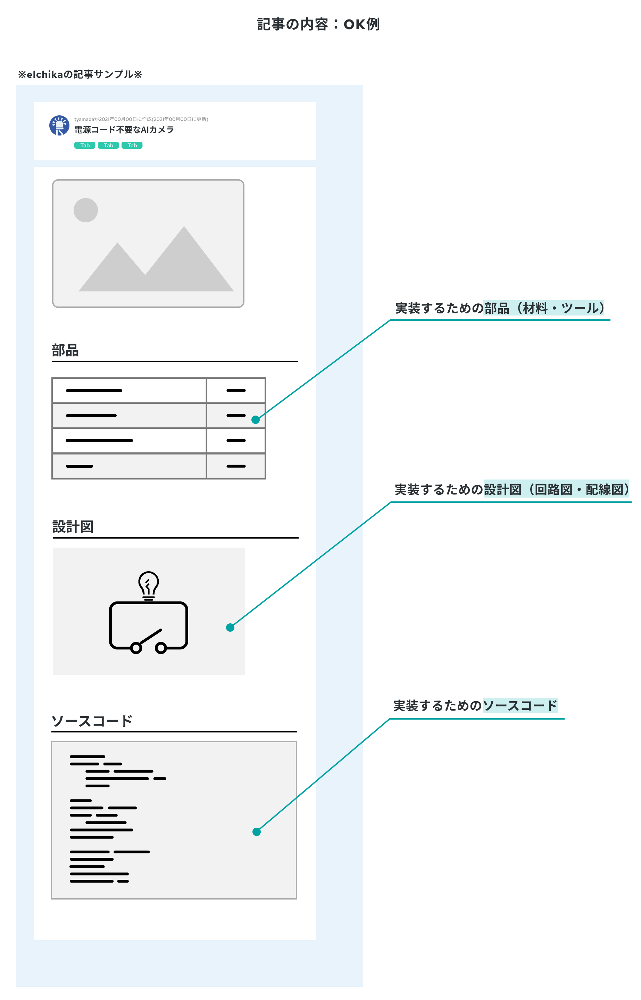

# AI Refrigerator

elchika投稿作品

[応募要項](https://elchika.com/promotion/spresense2023/conditions/)に従って、記事を作ります。
提出のために、応募フォームにMarkdown形式で以下の画像のようなフォームを作成するのが目的です。

アンチパターン

今回小規模なので、記事をREADME上で書いていくので良いかと思っています。
# ここから上は提出時に消す！！

# AI 冷蔵庫（仮）
