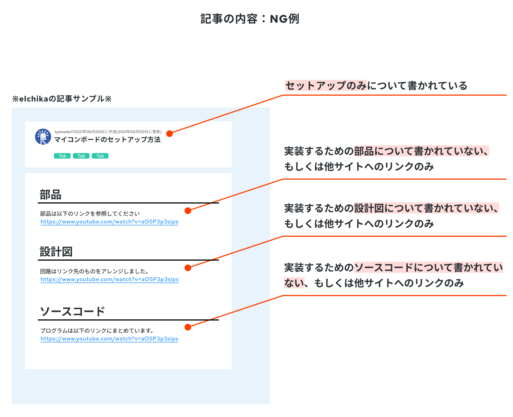

# AI Refrigerator

elchika投稿作品

[応募要項](https://elchika.com/promotion/spresense2023/conditions/)に従って、記事を作ります。
提出のために、応募フォームにMarkdown形式で以下の画像のようなフォームを作成するのが目的です。

アンチパターン

今回小規模なので、記事をREADME上で書いていくので良いかと思っています。
# ここから上は提出時に消す！！

### ここに久保谷君がスクショしたチャット画面
# AI 冷蔵庫（仮）
## 概要
私たちは、「SPRESENSE」を用いて、どこにいても冷蔵庫内の食材をチェックできるシステムのプロトを開発しました。このシステムでは、冷蔵庫内をカメラで撮影し、その画像をサーバーに保存します。ユーザーはどこからでもこれらの画像を閲覧でき、現在の食材のストックを一目で確認できます。

また、このシステムは画像認識機能を備えた対話モデル、GPT-4Vを利用しています。これにより、ユーザーは冷蔵庫の中身を基にした夕食の提案を受けたり、何を作れるかについてアドバイスをもらったりすることができます。この機能は、ユーザーが直接画像を見ることなく、冷蔵庫にある食材から最適な献立を提案します。

## システムアーキテクチャ
このシステムは以下のようなアーキテクチャ構成になっています。

## 使用した部品・サービス
- SPRESENSEメインボード
- SPRESENSE拡張ボード
- SPRESENSE HDRカメラボード
- SPRESENSE Wi-Fi Add-onボード
- SDカード
- (webサーバーとかで使用しているものの記載お願いします)
- PLAフィラメント
  
## 開発に使用したツール
- Arduino IDE
- (コーディングに使用したものの記載お願いします)
- Sindoh 3DWOX 2X 3D Printer
- Fusion360

## コーディング
（小西さん・久保谷さん　お願いしますm(__)m）

## モデリング
より冷蔵庫内の食材を正確に把握できるように、各環境（冷蔵庫）に合わせて、設営場所・カメラ角度を変えれるようなケースをモデリングしました。
角度調整部は[こちらのボールジョイントを](https://www.thingiverse.com/thing:1156296)、SPRESENSE固定部は[公式githubを](https://github.com/sonydevworld/spresense-hw-design-files/blob/master/Case/LTE-Board-Case-Sample/stl/LTE-Board-Case-Sample_bottom.stl)を参考にさせていただきました。

（参考にした角度調整部（左）参考にしたSPRESENSE固定部（右））

モデリングにはFusion360を、プリントにはSindoh 3DWOX 2X 3D Printerを使用しました。
実際のモデルデータは[github](https://github.com/konikoni428/ai_refrigerator/tree/main/case_model)に置いています。

（制作した土台部分のモデル（左）制作したSPRESENSE固定部（右））

はじめてのモデリングでしたが、きれいに出力されました

（ボール部分によって角度調整が可能（左・中央）。実際にSPRESENSEをマウントして撮影している様子（右））

## ソースコード
（小西さん・久保谷さん　お願いしますm(__)m）

