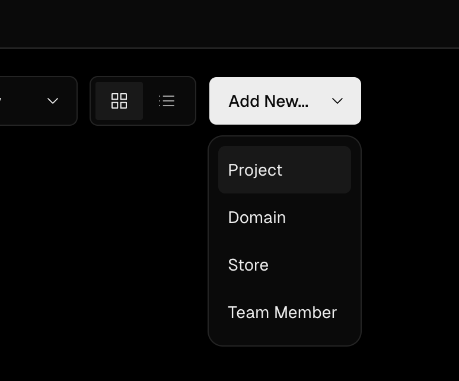
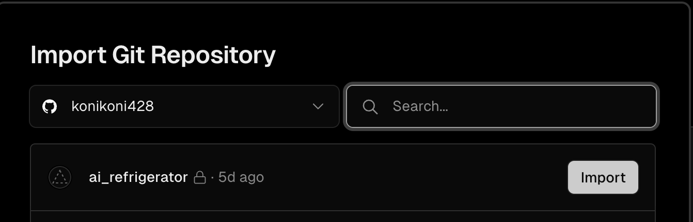
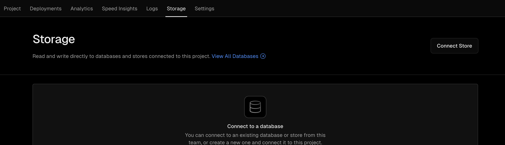
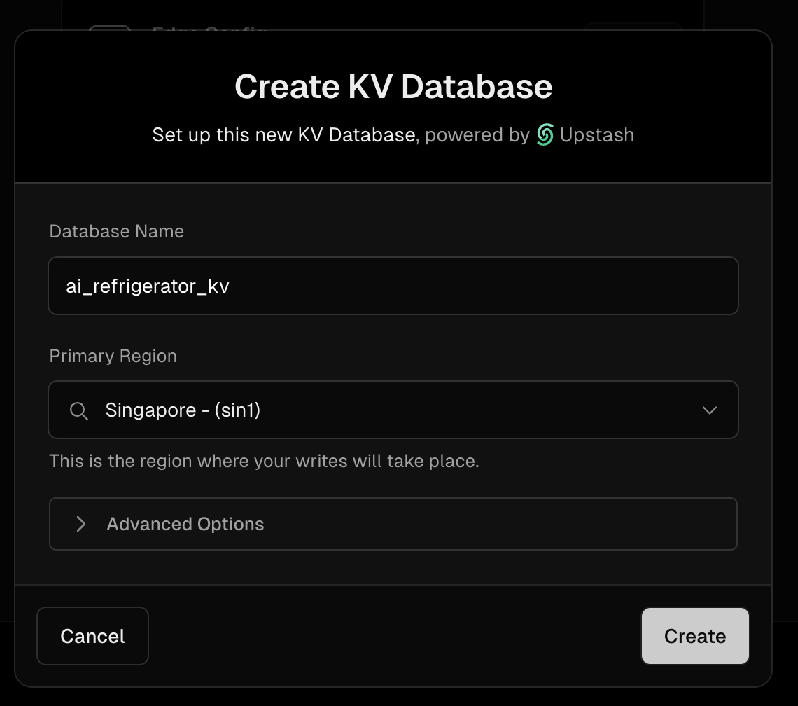
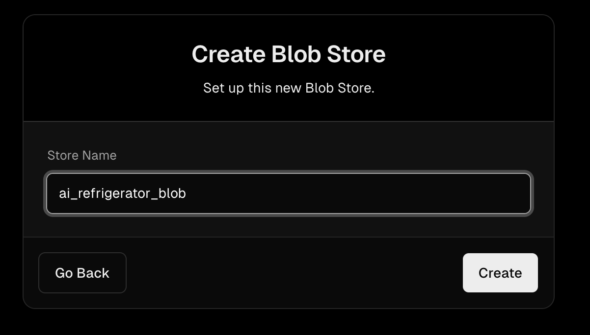
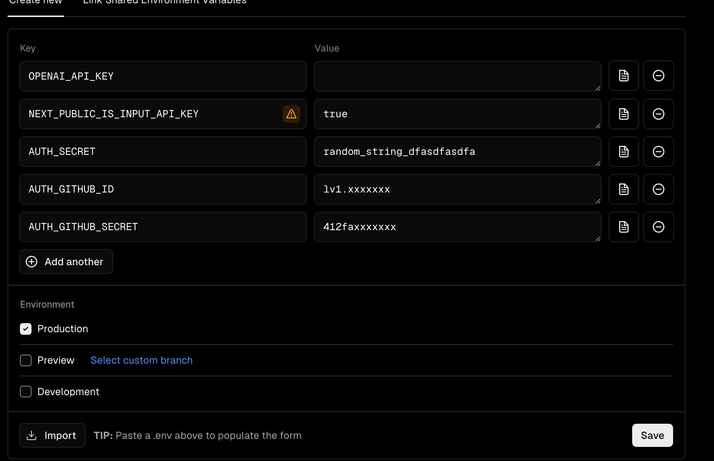
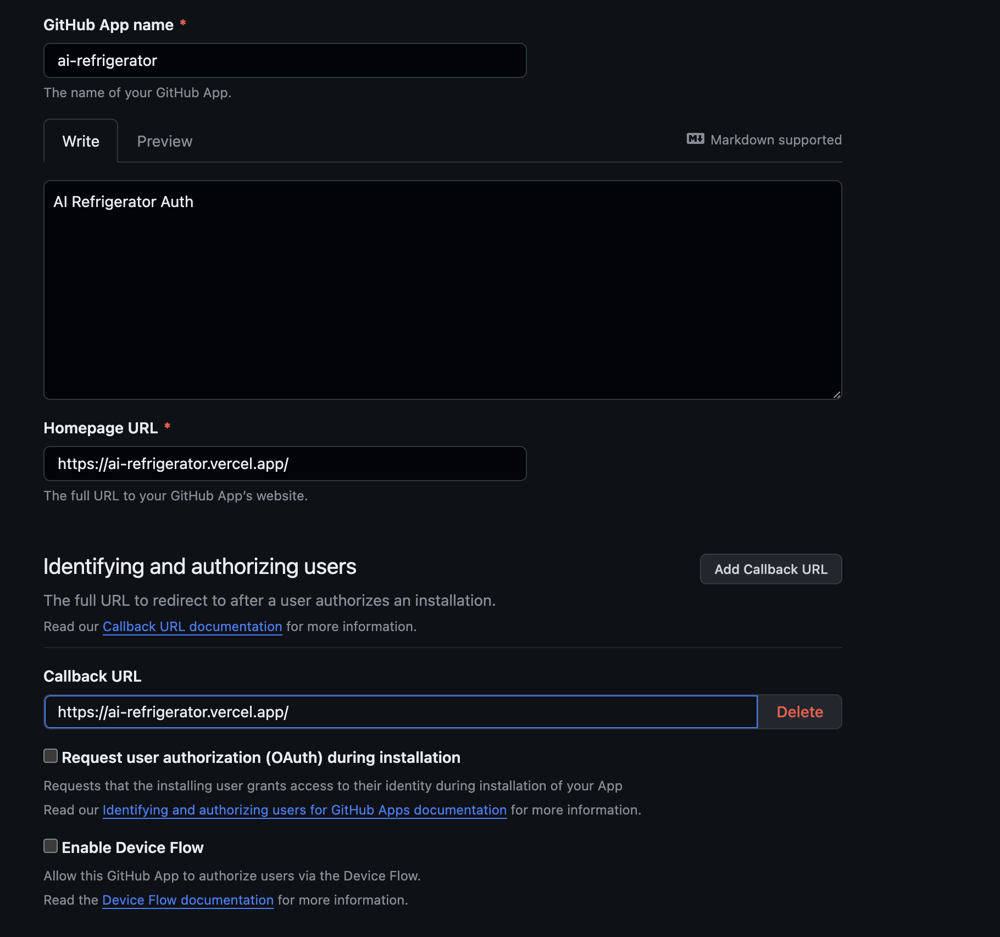
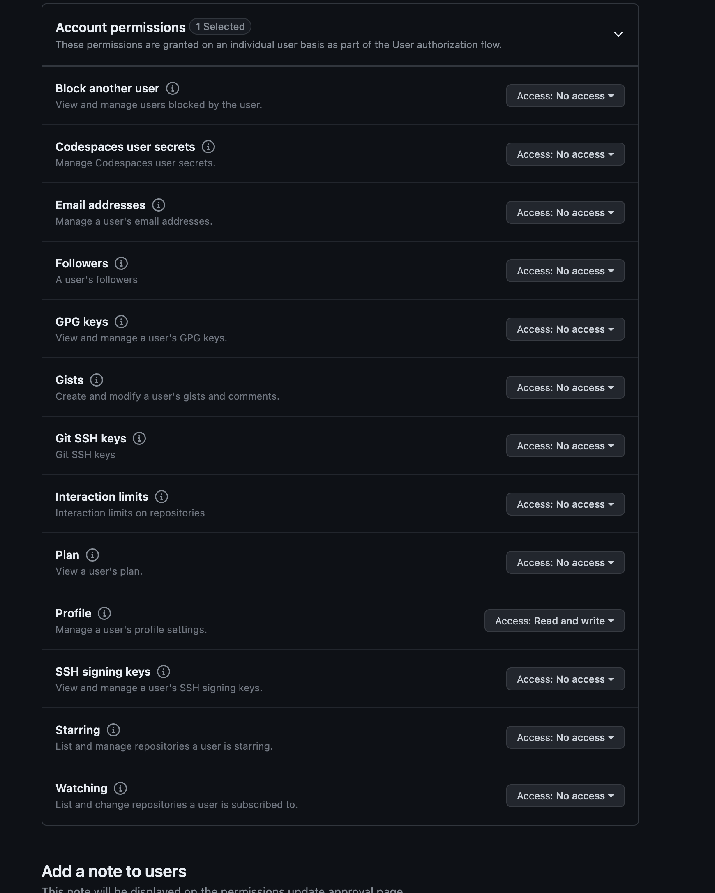
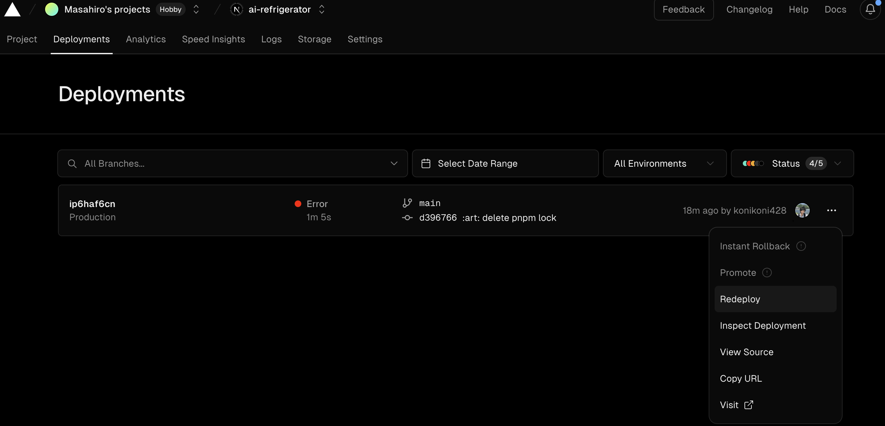

# Web Setup

Web frontend/backend の設定方法です。
本プロジェクトはNext.jsを使い、Vercelでホストして使用可能です。

## Vercel Setup
1. Fork
まず本リポジトリをForkし、各個人でのリポジトリ管理下に置いてください

2. Vercelで新規プロジェクトを追加し、デプロイする

Add New → Project


ForkしたリポジトリをImport


Configure ProjectでRoot Directoryを`web`に変更


> [!NOTE]  
> デプロイには失敗しますが気にせず進めてください

3. Vercel KV / Vercel Blobを有効化する

Storageタブを開く


Vercel KV, Vercel Blobをそれぞれ追加する。
その時の設定値は基本自由に設定して良い




この設定をすることで必要な環境変数が自動で設定される

4. 環境変数を設定する

不足している環境変数を設定します


| KEY                          | 説明                                                                           |     | 
| ---------------------------- | ------------------------------------------------------------------------------ | --- | 
| OPENAI_API_KEY               | OPEN APIのキー。NEXT_PUBLIC_IS_INPUT_API_KEYがtrueの場合はこのキーが使用される |     | 
| NEXT_PUBLIC_IS_INPUT_API_KEY | OPENAPIのキーを利用者に入力させるかどうか(true/false)                          |     | 
| AUTH_GITHUB_ID               | Github認証のため。Github Appsにて発行                                          |     | 
| AUTH_GITHUB_SECRET           | Github認証のため。Github Appsにて発行                                          |     | 
| AUTH_SECRET                  | ランダムな文字列を設定する                                                     |     | 



> [!NOTE]
> 画像は`NEXT_PUBLIC_IS_INPUT_API_KEY`が`true`の場合です。  
> `OPENAI_API_KEY`は使用されませんが、適当な文字列を入力しておく必要があります。  
> なおこの値はproduction/preview/developmentでそれぞれ変更することが可能です

> [!NOTE]
> OpenAPI APIKeyの取得と、Github Appsの詳細な設定は本説明の範囲外となります。

参考までにGithub Appsの設定は以下の画像のようになっております




5. 再デプロイ

ここまでくると必要な設定は終了したため、Deploymentタブに移動しRedeployをします



StatusがReadyになるとデプロイ完了です。
表示されているURLにアクセスし、使用可能か確認してください

## ローカルでの開発

上記手順を行うと、必要な環境変数の設定やVercel KV, Vercel Blobの設定が終わっているため、ローカルでも開発ができるようになります。

> [!NOTE]
> Node.jsをすでにインストールしている前提での説明となります

1. Vercel CLIのインストール
```bash
npm i -g vercel
```

2. リポジトリのクローン
```bash
git clone https://github.com/xxxxx/xxxxxx
```

3. プロジェクト環境直下に移動する

```bash
cd ai_refrigerator
```

4. vercel CLIのセットアップ
ログインしていない場合はログインが求められ、その後対話形式で設定できます

```bash
vercel

Vercel CLI 33.0.1
? Set up and deploy “~/programs/ai_refrigerator”? [Y/n] y
? Which scope do you want to deploy to? xxxxxx's projects
? Found project xxxxxx-projects/ai-refrigerator”. Link to it? [Y/n] y
🔗  Linked to xxxxxx-projects/ai-refrigerator (created .vercel and added it to .gitignore)
🔍  Inspect: https://vercel.com/xxxxxx-projects/ai-refrigerator/142L6cBjgRFEWGMsvdPxRsaTDMTN [34s]
✅  Preview: https://ai-refrigerator-c2bk99jy3-xxxxxx-projects.vercel.app [34s]
```

5. 依存パッケージをインストール
```bash
cd web
npm install
```

6. 開発サーバーを立ち上げ
```bash
npm run dev
```

http://localhost:3000 
にアクセスすることで確認可能です
